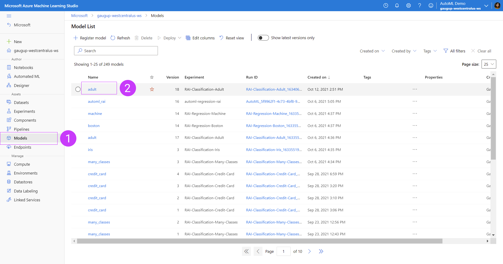
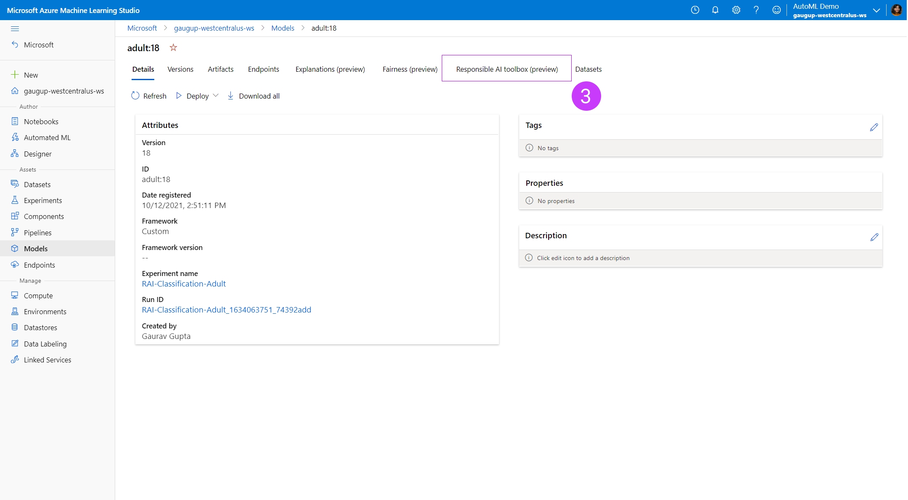
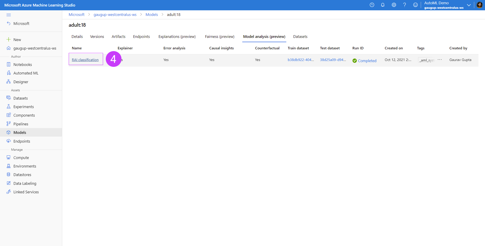
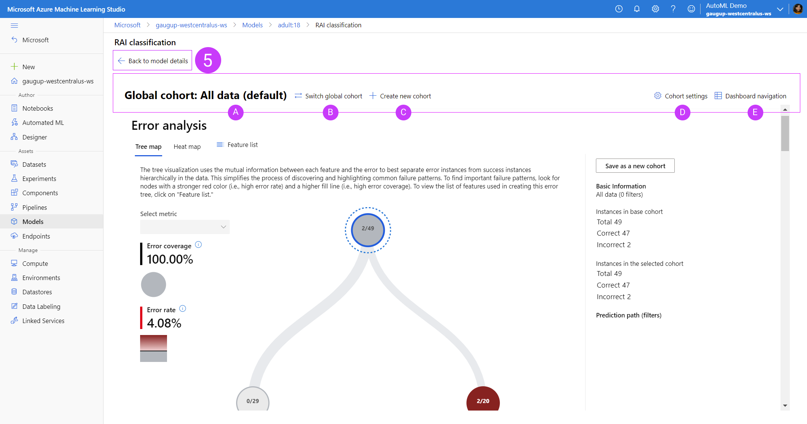
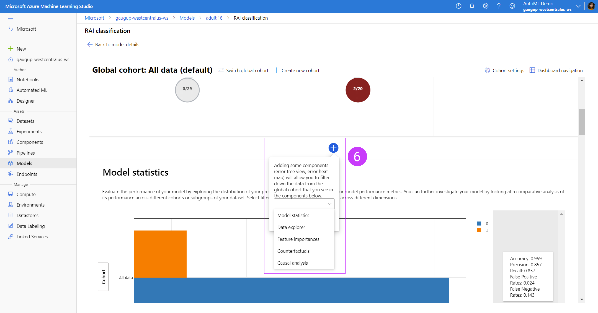

# Azure Machine Learning Responsible AI Dashboard - Private Preview

Welcome to the private preview for the new Responsible AI dashboard in Azure Machine Learning (AzureML) SDK and studio. The following is a guide for you to onboard to the new capabilities. For questions, please contact mithigpe@microsoft.com.

## What is this new feature?

AzureML currently supports both [model explanations](https://docs.microsoft.com/en-us/azure/machine-learning/how-to-machine-learning-interpretability-aml) and [model fairness](https://docs.microsoft.com/en-us/azure/machine-learning/how-to-machine-learning-fairness-aml) in public preview. As we expand our offerings under Responsible AI tools for AzureMl users, this new feature brings pre-existing features and brand new offerings under one-stop-shop SDK package and studio UI dashboard:
- Error Analysis: view and understand the error distributions of your model over your dataset via a decision tree map or heat map visualization.
- Data Explorer: explore your dataset by feature sets and other metrics such as predicted Y or true Y
- Model Statistics: explore the distribution of your model outcomes and performance metrics
- Interpretability: view the aggregate and individual feature importances across your model and dataset
- Counterfactual What-Ifs: create automatically generated diverse sets of counterfactual examples for each datapoint that is minimally perturbed in order to switch its predicted class or output. Also create your own counterfactual datapoint by perturbing feature values manually to observe the new outcome of your model prediction.
- Causal Inferencing: view the aggregate and individual causal effects of *treatment features* (features which you are interested in controlling to affect the outcome) on the outcome in order to make informed real-life business decisions. Also perturb the treatment features to see its affect on your real-life outcome.

This new feature offers users a new powerful and robust toolkit for understanding your model and data in order to develop your machine learning models responsibly, now all in one place and integrated with your AzureML workspace.

❗ **Please note:** This initial version of the Responsible AI dashboard currently does not support the integration of fairness metrics. For fairness metrics, please refer to our existing offering [here.](https://docs.microsoft.com/en-us/azure/machine-learning/how-to-machine-learning-fairness-aml)

## Supported scenarios, models and datasets

## Set Up
In this section, we will go over the basic setup steps that you need in order to generate Responsible AI insights for your models from SDK and visualize the generated Responsible AI insights in [AML studio](https://ml.azure.com/).

### Installing `azureml-responsibleai` SDK
In order to install `azureml-responsibleai` package you will need a python virtual environment. You can create a python virtual environment using `conda`.
```c
conda create -n azureml_env python=3.6.12 nb_conda -y
```

Once the `conda` environment `azureml_env` is created, you can install `azureml-responsibleai` using `pip`.

```c
activate azureml_env
pip install azureml-responsibleai
pip install liac-arff
```

### Create an Azure subscription
Create an Azure workspace by using the [configuration notebook](https://github.com/Azure/MachineLearningNotebooks/blob/master/configuration.ipynb)

### Generating responsibleai AI insights
Once you have installed `azureml-responsibleai` and created an Azure workspace, you can execute the responsibleai notebooks in the `notebooks` [folder](notebooks/model-analysis) in this repo.

### Viewing your Responsible AI Dashboard in the AzureML studio portal
After generating the Responsible AI insights via SDK, you can view them in your associated workspace in AzureML studio, under your model registry.


1. Go to your model registry in your AzureML studio workspace
2. Click on the model you've uploaded your Responsible AI insights for


3. Click on the tab for `Model analysis (preview)` under your model details page


4. Under the `Model analysis (preview)` tab of your model details, you will see a list of your uploaded Responsible AI insights. You can upload more than one Responsible AI dashboards for each model. Each row represents one dashboard, with information on which components were uploaded to each dashboard (i.e. explanations, counterfactuals, etc).


5. At anytime viewing the dashboard, if you wish to return to the model details page, click on `Back to model details`
<ol type="A">
  <li>You can view the dashboard insights for each component filtered down on a global cohort you specify. Hovering over the global cohort name will show the number of datapoints and filters in that cohort as a tooltip.</li>
  <li>Switch which global cohort you are applying to the dashboard.</li>
  <li>Create a new global cohort based on filters you can apply in a flyout panel.</li>
  <li>View a list of all global cohorts created and duplicate, edit or delete them.</li>
  <li>View a list of all Responsible AI components you've uploaded to this dashboard as well as deleting components. The layout of the dashboard will reflect the order of the components in this list.</li>
</ol>

❗ **Please note:** Error Analysis, if generated, will always be at the top of the component list in your dashboard. Selecting on the nodes of the error tree or tiles of the error heatmap will automatically generate a temporary cohort that will be populated in the components below so that you can easily experiment with looking at insights for different areas of your error distribution.


6. In between each component you can add components by clicking the blue circular button with a plus sign. This will pop up a tooltip that will give you an option of adding whichever Responsible AI dashboard component you enabled with your SDK.

#### Known limitations of viewing dashboard in AzureML studio
Due to current lack of active compute and backend storing and recomputing your model analysis in real time, the dashboard in AzureML studio is much less robust than the dashboard generated with the SDK. You can generate and view the full dashboard in a Jupyter python notebook with our SDK package. Some limitations in AzureML studio include:
- Retraining of the Error analysis tree on different features is disabled
- Viewing the Error analysis tree or heatmap on a subset of your full dataset passed into the dashboard is disabled
- Manually creating a What-If datapoint is disabled; you can only view the counterfactual examples already pre-generated by the SDK
- Causal analysis individual what-if is disabled; you can only view the individual causal effects of each individual datapoint

## Responsible AI Dashboard walkthrough and sample notebooks
Please read through our [sample notebooks for both regression and classification](notebooks/model-analysis) to see if this feature supports your use case. For more details about each individual component, please read through our brief [tour guide of the new Responsible AI dashboard capabilities.](https://github.com/microsoft/responsible-ai-widgets/blob/main/notebooks/responsibleaitoolbox-dashboard/tour.ipynb) 

## What Next?: How to join Private Preview 👀
We are super excited for you to try this new feature in AzureML! 
- Reach out to mithigpe@microsoft.com to enable your Azure subscription for this Private Preview feature.
- Fill out this form - Private Preview sign up for [Responsible AI Dashboard in AzureML](https://forms.office.com/r/R6PmBCkyWb)

## Contributing

This project welcomes contributions and suggestions.  Most contributions require you to agree to a
Contributor License Agreement (CLA) declaring that you have the right to, and actually do, grant us
the rights to use your contribution. For details, visit https://cla.opensource.microsoft.com.

When you submit a pull request, a CLA bot will automatically determine whether you need to provide
a CLA and decorate the PR appropriately (e.g., status check, comment). Simply follow the instructions
provided by the bot. You will only need to do this once across all repos using our CLA.

This project has adopted the [Microsoft Open Source Code of Conduct](https://opensource.microsoft.com/codeofconduct/).
For more information see the [Code of Conduct FAQ](https://opensource.microsoft.com/codeofconduct/faq/) or
contact [opencode@microsoft.com](mailto:opencode@microsoft.com) with any additional questions or comments.

## Trademarks

This project may contain trademarks or logos for projects, products, or services. Authorized use of Microsoft 
trademarks or logos is subject to and must follow 
[Microsoft's Trademark & Brand Guidelines](https://www.microsoft.com/en-us/legal/intellectualproperty/trademarks/usage/general).
Use of Microsoft trademarks or logos in modified versions of this project must not cause confusion or imply Microsoft sponsorship.
Any use of third-party trademarks or logos are subject to those third-party's policies.
